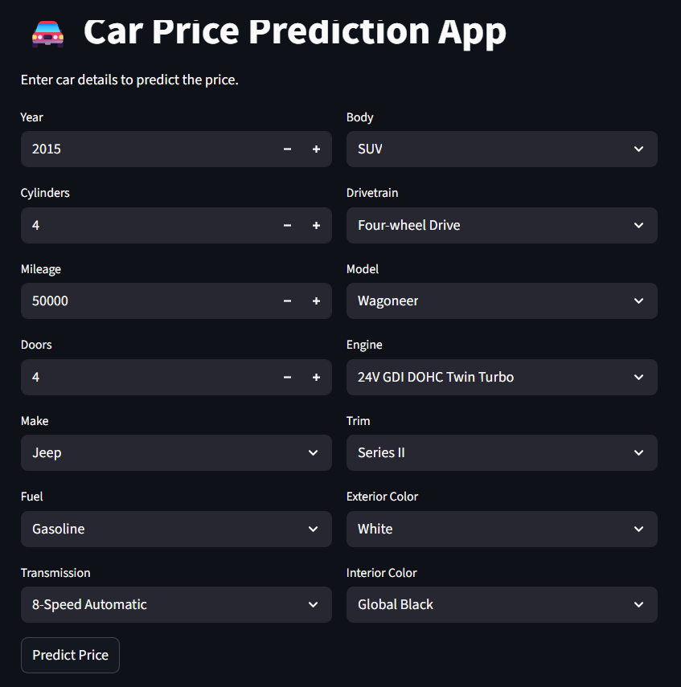

# Vehicle Price Prediction using Machine Learning

## Objective:
The goal of this project is pridicting the vehicles price based on their specification such as make, model, mileage, engine details, and other attributes.
This helps understand what factor influence the vehicle prices and build a reliable price prediction system using machine learning.

## How to access the Vehicle price prediction app
Copy the below link and open in web browser to get access.

Vehicle price prediction app: https://project1vehiclepricedetection.streamlit.app/ 

## Dataset used:
Download : https://github.com/Kumard8x/Project_1_Vehicle_price_Detection/blob/main/dataset.csv

Dataset contain feature and target Variable:

        'name', 'description', 'make', 'model', 'year', 'price', 'engine',
        'cylinders', 'fuel', 'mileage', 'transmission', 'trim', 'body', 'doors',
        'exterior_color', 'interior_color', 'drivetrain'


## Technology used:
Tools, library, and Language.
- Python
- Pandas
- Numpy
- Matplotlib/Seaborn
- Scikit-learn
- Jupyter notebook


## Installation:

```bash
1. Clone the repository and used the project
git clone https://github.com/Kumard8x/Project_1_Vehicle_price_Detection.git

2. Navigate the project directory
cd Project_1_Vehicle_price_Detection

3. Install requirement libraries
pip install -r requirements.txt

```

## How to use:
Open terminal in VScode and run below cmd.
```bash
streamlit run script.py
```

## Model evaluation:

Metrics used:
- R² Score
- Mean Absolute Error (MAE)
- Root Mean Squared Error (RMSE)

## Result

The model successfully captures the relationship between vehicle specifications and price.
Features like year, mileage, make, engine type, and drivetrain have a strong influence on price.

## Snapshot:

